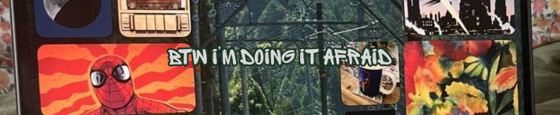
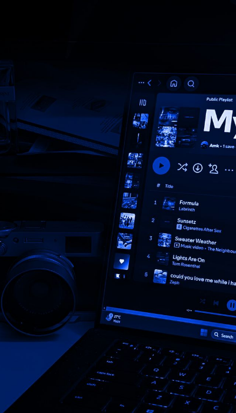

<h1 align="center">Running on Caffeine and Spite ฅᨐฅ</h1>

  

Currently experimenting with frameworks like **NestJS, NextJS, and whatever breaks my brain in a good way** ฅ ฅ

˚🐾˖° Always down to collaborate on something **weird, ambitious, or beautifully over-engineered**

Documenting the messy art of making cool things — now live at [aditsuru.com](https://aditsuru.com) ₍^. .^₎Ⳋ

🐱ྀི I love quite the cave life, ask me about anything:

　 𖹭 Full-Stack Web Development & System Design  
　 𖹭 Game Development cuz it's love (Unity & Roblox; Indie kit)  
　 𖹭 Leadership, Management & Startup Chaos  
　 𖹭 Generative and Agentic AI  
　 𖹭 Mobile Dev 

ᯓᡣ𐭩 **Fun Fact:** My code runs smoother than my love life 💔

  

<h2 align="left">Languages and Tools</h2>

                                           

<h2 align="left">Projects</h2>

<h3 align="left">Aethel</h3>

A social media app built in NextJS with Drizzle, Better-Auth, oRPC and S3. [Get demo here](https://github.com/aditsuru/glimpse)

  
  
  

<h3 align="left">Aethel</h3>

Experience a live, AI-powered writing space for all your stories and docs. [Get demo here](https://github.com/homies-tech-innovation/aethel)

  
  
  

Always stalking new ideas to add to the hoard... 🧶

≽^•⩊•^≼

I also lead and host a growing community of 200+ developers and creators. We build, break, and innovate together. You can join our [Discord](https://discord.com/invite/HP2YPGXh6) and also checkout our [GitHub Organization](https://github.com/homies-tech-innovation).

<h2></h2>

  
  &nbsp;
  

  
  &nbsp;
  

